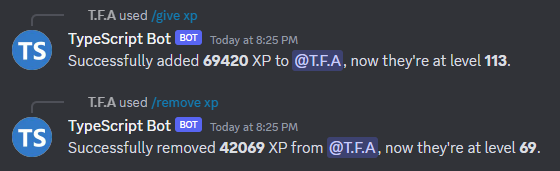

<p align="center">
    
    
    <h3 align="center">The Mee6 and Lurkr Leveling system clone</h3>
</p>

# NetLevel Bot (ALPHA RELEASE)

NetLevel Bot is a powerful leveling Discord bot that uses discord.js version 14 as the main library to interact with the Discord API, and canvacord as the main library to create rank cards images.

This project has the similar leveling system as Mee6 and Lurkr, same formula and few other useful commands. Let's check the differences:

- Mee6:
    - Non open-source project.
    - Useful commands and features of leveling system (`/give-xp`, `/remove-xp`, rate... etc) are restricted for free users.
    - No role-rewards by XP, except if you pay to Mee6 subscriptions.
    - Premium is very expensive.

- Lurkr:
    - Non open-source project.
    - Useful commands and features of leveling system are free, but has some limits (5 max no xp roles... etc).
    - Role-rewards XP is free, but has some limits (30 roles only).
    - Premium is cheap.
    - Import XP from a specific server, allowed bots to import from:
        - Mee6
        - Amari
        - Atlas

- NetLevel:
    - Open-source project.
    - Every useful Mee6 and Lurkr commands and features and free, no limits exist.
    - Unlimited role-rewards by XP.
    - No premium since everything is free.
    - Muti-guild bot
    - Import XP from any server, using any guild ID. Allowed bots to import from:
        - Mee6
    - Editable commands message (since this is an open-source bot).

### Special features:
- Issues from commands will be saved in the database, readable and deletable.
- Better user's leveling information command.

### Upcoming features:
- Roles stacking method.
- Other useful commands.
- Better performance.

# Preview





# Requirements
## Dependencies:

- **discord.js** v^14.13.0
- **@napi-rs/canvas** v^0.1.44
- **@prisma-client** v^5.2.0
- **axios** v^1.4.0
- **chalk** v2.4.2
- **dotenv** v^16.3.1
- **uuid** v^9.0.0

> **Important**
> The package **canvacord** has it's source installed on this project, so avoid to install it via `npm install` command to bypass the latest typings errors.

> **Warning**
> Make sure that the package **chalk** has the version **v2.4.2** installed because this bot uses CommonJS modules, because the latest version uses ES6 modules.

## Dev-dependencies
- **@types/uuid** v^9.0.3
- **prisma** v^5.2.0

# How to start the bot

1. Initialize a new package using this following command: `npm init`
2. Install all required packages, by following it's required version ([Click here](#dependencies)): `npm install`
3. Fill all required information of the bot in **src/example.config.ts**, and rename the file to **config.ts**.

```ts
export default {
    developers: ['YOUR ACCOUNT ID'],
    ownerId: 'YOUR ACCOUNT ID'
};
```

4. Fill all required information of the bot again, but in **.env.example**, and rename the file to **.env**.

```apache
CLIENT_TOKEN = "YOUR BOT TOKEN"
CLIENT_ID = "YOUR BOT ID"

# Do not change if you're using SQLite as the main database
DATABASE_URL = "file:./dev.db"
```

5. Compile the TypeScript files and then run the bot: `npm run build`
6. Enjoy! :)

# Frequently Asked Questions (FAQs):

## Is it possible to make this bot public?
Yes it is possible, but it's not recommended since the database might reach 1GB size or more if your bot is more than in 1000 servers, which lowers your database performance. You can make the bot private, even if your server has more than 500,000 members (and the users are active), the database file will reach only to 1MB, which is good and it won't lose it's performance while reading and writing the SQLite file.

You can change the main database source from SQLite to any other sources that available to Prisma ORM, such as MongoDB, postgresql... etc.

It's recommended to make your bot private because of the command `/import`, read the first warning in this following question: [How to import the XP from the Mee6 database?](#how-to-import-the-xp-from-the-mee6-database).

## How to import the XP from the Mee6 database?
The Mee6 has an API that doesn't have a documentation yet, you can fetch some users XP using the following link below:

```
https://mee6.xyz/api/plugins/levels/leaderboard/GUILD_ID
```

- **page** (integer): The page of the leaderboard, similar like indexes of an array. The default value is **0**.
- **limit** (integer): The limit of users to show on the JSON output, must be in this following this condition: **𝑥 ∈ [0, 1000]**

```
https://mee6.xyz/api/plugins/levels/leaderboard/GUILD_ID?page=0
https://mee6.xyz/api/plugins/levels/leaderboard/GUILD_ID?limit=100

https://mee6.xyz/api/plugins/levels/leaderboard/GUILD_ID?page=20&limit=8
```

Make sure to replace "**GUILD_ID**" with an actual server ID that Mee6 is invited on. If Mee6 is on the server but returns an error while fetching using it's API, you must enable the leaderboard to the public, which means anybody can see the users XP leaderboard.

> **Warning**
> You have a chance of getting rate-limited by Mee6 API, which means you'll get a temporary ban (30 minutes) and you'll be able to use it again. If you get rate-limited again on the same day (24 hours), you will get another temporary ban (2 hours), and then, it's going to be a permanent IP ban.

> **Note**
> You can bypass the Mee6 API rate-limit and bans by changing your IP, but it's not recommended. Here is how to bypass:
> - Open your browser tab and search "What's my IP address", and then don't close the tab.
> - Use one of the methods below, and then open another tab with the same search as the previous tab, if the IPs are different from the previous tab and the new one, you're good to go!
>   - Install a free or premium VPN.
>   - If you own a dynamic router, you can restart it for a different IP.
>   - Pay for some internet on your phone, open Hotspot, and connect to it with your pc.
>
> To avoid the bans and rate-limits, just do not abuse the `/import` command. Else, you need to manipulate the IPs to bypass.

## What's the Mee6 leveling formula?

Default values of the formula:
```
base = 5
coefficient = 50
constant = 100
```

The function:
```
ƒ(𝑥) = base * (𝑥²) + (coefficient * 𝑥) + constant;
```

The **𝑥** represents the level of a user, must be following in this condition: **𝑥 ∈ [0, +∞[**

## How to set the custom level up message?

Use the `/config` command. The string has 4 variables to use:
- **{user}**: The user mention.
- **{userId}**: The user ID.
- **{username}**: The user's username.
- **{level}**: The new level achieved.

Example command usage: **/config set `configuration`: "Set custom level up message" `string`: "GG {user}, you have reached level {level}!"**

## How the non-role reward stacking system works?

If the server's configuration has role rewards, and if a user reaches one of the levels in the role-rewards database, they'll earn the role and saves the role ID in the user's column (in the users database) as `lastRoleIdGiven` variable. If the user reaches another level that has different role reward and different level reward (level must be higher than the latest role reward level), the role from `lastRoleIdGiven`'s role ID will be removed, and then adds the new role, and saves the new role ID.

# License
**General Public License** v3.0 ([View](./LICENSE))